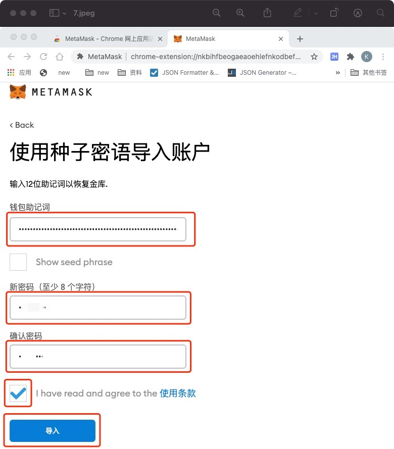
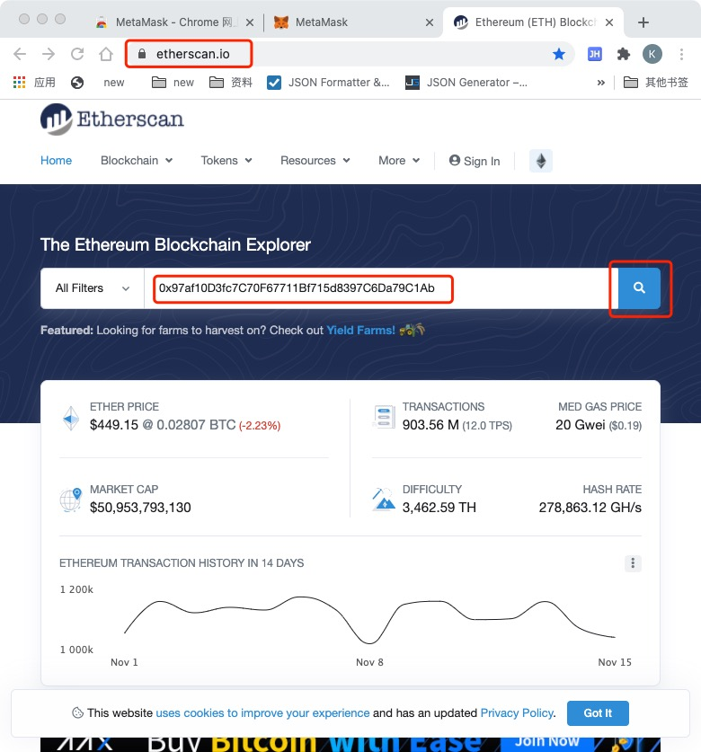
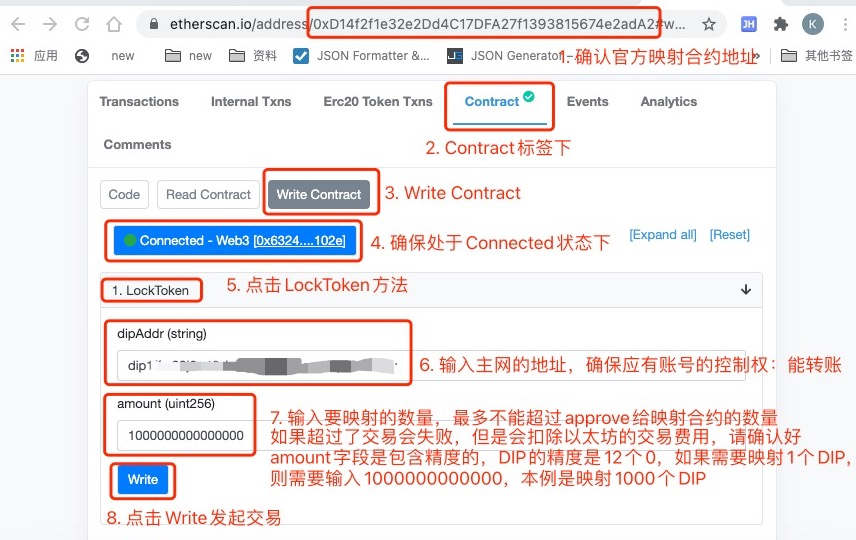
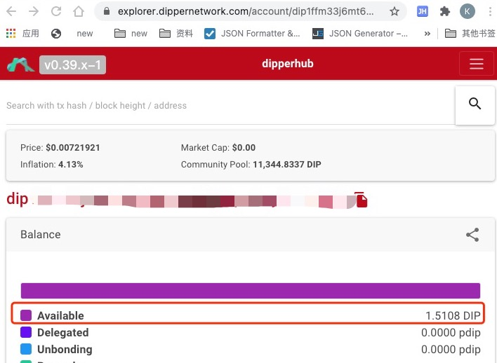

## 如何映射

### 1. 浏览器安装MetaMask
MetaMask支持Google Chrome、Firefox浏览器，本文使用Chrome为例。

- 打开Chrome浏览器，输入MetaMask的搜索地址
```url
https://chrome.google.com/webstore/search/metamask?hl=zh-CN
```


- 滚动弹出的页面到最下方，点击'添加至 Chrome'按钮


- 在弹出的对话框中点击'添加扩展程序'


- 浏览器会自动完成插件的下载和安装并展示'欢迎使用MetaMask测试版'页面


### 2. 导入以太坊账号到MetaMask
- 在'欢迎使用MetaMask测试版'页面，点击'开始使用'按钮


- 弹出'新增至MetaMask?页面，点击'导入钱包'按钮


- 在弹出的页面中点击'I Agree'按钮，弹出'使用种子密语导入账户'页面


- 按照要求输入'钱包助记词'，'新密码'，'确认密码'，勾选'I have read and agree to the 使用条款'，点击导入
如果你的以太坊账号在ImToken，可以通过ImToken客户端导出，依次点击'我'-->'管理钱包'-->点击要导出的以太坊地址-->'管理身份钱包'-->'备份钱包'，根据提示得到助记词(注意：妥善保管助记词，不要截图，不要在微信等通讯工具发送，不要被摄像头拍到，确保身边没人等)



- 点击导入后弹出'恭喜'页面


- 点击'全部完成'后弹出你以太坊的账号详情，核对账号地址和账号余额等信息，确认无误后完成账号导入


### 3. 创建Dipper Network主网地址
可以通过官方钱包完成也可以通过节点客户端dipcli完成

#### 3.1 官方钱包下载地址(目前只支持安卓，IOS开发测试中): http://fir.highstreet.top/dipperwallet
安装后根据提示创建账号

#### 3.2 节点客户端dipcli创建账号
- 如果没有安卓手机可以采用这种方式
- 需要linux或者Mac osx操作系统，参考文档安装Dipper Network节点程序
```
https://docs.dippernetwork.com/software/how-to-install.html#%E5%AE%89%E8%A3%85%E4%B8%BB%E7%BD%91
```

- 安装完毕后执行创建账号
```
dipcli keys add [account name]
# e.g.
dipcli keys add alice

Enter a passphrase to encrypt your key to disk:
Repeat the passphrase:
{
  "name": "alice",
  "type": "local",
  "address": "dip1kku6g066hzl6pxm7ldf8ydl2wn7damy3q3awl8",
  "pubkey": "dippub1addwnpepqdfwplcx7gq8grqaeq9tqc45799jyd4qa2qgspx8r03vwk5ueppu7tknz8w",
  "mnemonic": "spirit uncle slender inform fit ignore pretty law ink depart spike panic hen obscure"
}

mnemonic为助记词
address为账号地址

# 根据提示输入两次密码后程序会在本地创建账号，并输出助记词，账号地址等信息，请妥善保管你的助记词等信息，防止资产丢失
```


### 4. 授权官方映射合约ERC20
- 打开以太坊浏览器: https://etherscan.io/，在以太坊浏览器搜索DIP的ERC20地址: 0x97af10D3fc7C70F67711Bf715d8397C6Da79C1Ab


- 点击Contract标签下的Write Contract标签


- 点击Connect to Web3,弹出的Connect a Wallet 对话框中选择MetaMask


- 点击下一步


- 点击连接


- 再次点击'Connect to Web3'，选择MetaMask


- 在弹出的对话框中点击'确定'


- 状态更新为'Connected'


- 点击approve
```
'_spender'字段填写官方映射合约地址0xD14f2f1e32e2Dd4C17DFA27f1393815674e2adA2
'_amount'字段填写要映射的数量，本例是1000个DIP，需要乘以精度，DIP的精度是12个0，即1000000000000000
点击确认无误后点击'Write'按钮
```


- 点击确认发送交易


- 点击'View your transaction'按钮查看交易


- 在交易详情页面确认交易成功后才能进一步操作
这是交易还没有成功使的界面


交易成功后的界面，可以看到Status更新为Success


### 5. 映射
- 打开以太坊浏览器: https://etherscan.io/，在以太坊浏览器搜索DIP官方的映射合约地址: 0xD14f2f1e32e2Dd4C17DFA27f1393815674e2adA2


- 点击Contract标签下的Write Contract标签，确保MetaMask和以太坊主网的连接状态是'Connected'
本例中此时MetaMask和以太坊主网的连接状态为未连接，点击'Connect to Web3'


- 根据提示确保状态更新为'Connected'，如下图，按照图片提示填写，dipAddr填写你自己的主网地址，确保有账号的控制权，点击Write


- 确认无误后在弹出的确认框中点击'确认'发送交易


- 点击'View your transaction'按钮查看交易详情，等待交易成功


- 以下图片表示交易还没有被打包


- 以下图片表示交易成功了，记录交易成功的区块号，等待50个区块确认数


### 6. 查看主网账号到账
- 打开主网浏览器: https://explorer.dippernetwork.com/，输入步骤5中的dipAddr地址回车查看账号余额
此时映射还没有完成，账号余额是1.5108DIP


- 查看以太坊浏览器步骤5的交易，经过50个以太坊区块确认后，如下图


- 再次查询主网地址的账号显示余额为1001.5108DIP，增加了1000个DIP，表示映射完成


### 7. 映射视频
- 哔哩哔哩
```url

```