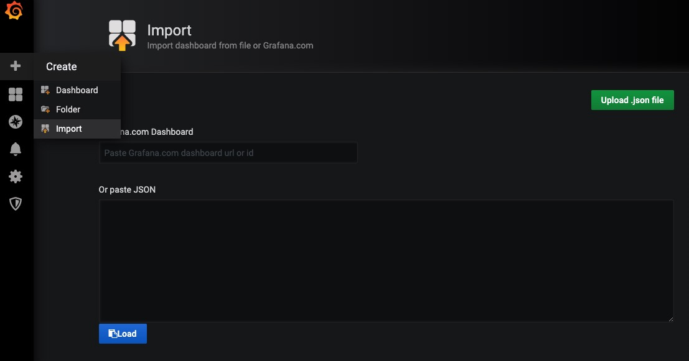

# DipperNetwork Monitor Tool

This article describes how to build DipperNetwork node monitoring based on Prometheus + Grafana open source tools.

## 1. Enalbe Prometheus metrics

update config file ```~/.dipd/config/config.toml```， to enable Prometheus metrics。

```text
prometheus = true

prometheus_listen_addr = ":26660"
```

and then restart ```dipd```.  Click [here](../advanced/Q&A.md#how-to-restart-the-node-program)。

## 2. Install Prometheus and Grafana

* Install Prometheus
  
```bash
sudo apt-get update
sudo apt-get install prometheus
```

* Install Grafana
  
Click [here](https://grafana.com/docs/grafana/latest/installation/debian/)，to install Grafana。 Or execute commands：

```bash
sudo apt-get install -y apt-transport-https
sudo apt-get install -y software-properties-common wget
wget -q -O - https://packages.grafana.com/gpg.key | sudo apt-key add -

sudo add-apt-repository "deb https://packages.grafana.com/oss/deb stable main"

sudo apt-get update
sudo apt-get install grafana
```

## 3. Start Prometheus and Grafana

* **Update Prometheus config**
  
update config file```/etc/prometheus/prometheus.yml```， and append content：
  
```text
  - job_name: 'DipperNetwork'
    static_configs:
    - targets: ['your_ip:26660']
      labels:
        instance: my_dip_node
```

Replace ```your_ip``` with your ip , replace ```my_dip_node``` with any name

You can check your config file with [YAML Lint](http://www.yamllint.com/)。

* **Start Prometheus**

```bash
sudo prometheus --config.file=/etc/prometheus/prometheus.yml
```

* **Start Grafana**

```bash
sudo service grafana-server start
```

* Add DataSource

Log in o ```http://your_ip:3000/``` with username ```admin``` and password ```admin```, and add DataSource by hitting the ```Login In button``` on the top.


Hit "Save & Test" to finish adding the DataSource.

* Add a Dashboard

Start importing by clicking on the + button at the top of the column on the left. Paste in the JSON from [here](https://github.com/Dipper-Labs/monitor/blob/master/dip_dashboard.json) and load it.


